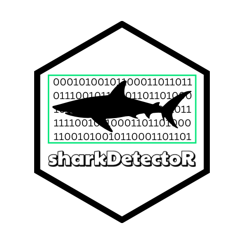

# sharkDetectoR <a href="http://seaql.org/wp-content/uploads/2022/06/SD.pdf"></a>

This R package provides functions for shark detection and classification from videos and images. It includes functions to submit videos and images to a Flask API for processing, and to visualize performance metrics. For increased customization, retraining, and faster processing speeds, please see the [Shark Detector version repository](https://github.com/sharkPulse/Shark-Detector). Version 4.0.0 can classify 69 species of sharks with an average accuracy of 82%.  

The Shark Detector is an AI application for detecting and taxonomically classifying shark species in visual media. Videos and images are processed stepwise, beginning with 1) extracting frames, 2) detecting any shark subjects, 3) cropping shark subjects to remove background noise, and taxonomically classifying to the genus and then species level, and finally 4) producing annotations.

[sharkPulse](https://sp2.cs.vt.edu) is an advanced cyber infrastructure designed to crowdsource global sightings and generate conservation knowledge with multiple computer vision, machine learning, and data science workflows. The Shark Detector functions as the main work engine to automate shark detection and species classification, and ingest new information to continuously improve itself. By demonstrating this AI platform in Hawaii, we show how easy and effective it is to boost the Shark Detector and advance new baselines of classification performance.   

We rely on crowdsourcing efforts to increase AI performance, so if you have footage of sharks that you want to contribute, please reach to the contacts below!

## Installation

You can install the package directly from GitHub using the `devtools` package:

```r
devtools::install_github("sharkPulse/sharkDetectoR")
```

## Usage
To use `sharkDetectoR`, process a video, an image, or a batch of images with these functions. Additionally, generate the most up-to-date performance reports and print the current list of classifiable shark genera and species and their corresponding accuracy. Media can be processed to return shark detections, bounding box coordinates, species classifications, prediction probability, and the name of the cropped and original (parent) image. Multiple detection boxes can be drawn per image.

- Process a video
```r
result <- process_video("video.mp4", download_images = TRUE, threshold = 0.95)
colnames(result)
 [1] "species"               "timestamp"             "ymin"                 
 [4] "xmin"                  "ymax"                  "xmax"                 
 [7] "detection_probability" "species_probability"   "img_name"             
[10] "parent_image"
```

For the graphical interface of this function, please visit sharkPulse for the [video processor](http://sharkpulse.org/video-processor).

<p align="left">
  
</p>

- Process an image 
```r
result_image = process_image("whiteshark.jpg", download_images = TRUE, threshold = 0.95)
colnames(result_image)
 [1] "species"               "timestamp"             "ymin"                 
 [4] "xmin"                  "ymax"                  "xmax"                 
 [7] "detection_probability" "species_probability"   "img_name"             
[10] "parent_image"
```

- Process a batch of images
```r
> results = process_directory("./images/", download_images = TRUE, threshold = 0.95)
Processing: carcharhinus.jpg 
Processing: hammerhead.jpg 
Processing: whiteshark.jpg 
Processing: whiteshark2.jpg 
Results saved to: detected_images/images.csv
```

## `iucn_list` Function

The `iucn_list` function allows you to query the IUCN and Aquamaps species distribution for any given geographical polygon. By scanning potential survey locations for assessment-driven species distributions, this function systematically informs biodiversity expectations and AI data-boosting efforts.

### Function Parameters

- `xmin` Numeric, minimum longitude of the bounding box.
- `ymin` Numeric, minimum latitude of the bounding box.
- `xmax` Numeric, maximum longitude of the bounding box.
- `ymax` Numeric, maximum latitude of the bounding box.

### Return Value

The function returns a data frame containing the following columns:

- **`species`**: The scientific name of each species present within the specified radius.
- **`aquamaps2020_prob`**: The average probability of occurrence from Aquamaps data within the specified radius. If no data is available, this value will be `NA`.
- **`category`**: The IUCN Red List conservation category for each species (e.g., `VU` for Vulnerable, `LC` for Least Concern).
- **`class`**: Classification as `shark` or `ray`.
- **`condition`**: Species presence condition, indicating if the species is known to be `Extant` (confirmed) or `Possibly Extant` in the specified area.
- **`DepthRangeComShallow`** Fishbase *common* depth classification (shallow)
- **`DepthRangeComDeep`** Fishbase *common* depth classification (deep)

### Example

Here’s an example of how to use the `iucn_list` function:

```r
# Sample usage
result <- iucn_list(xmin = -70, ymin = 40, xmax = -69, ymax = 41)
head(result[1:5])
species                 DepthRangeComDeep DepthRangeComShallow    
1  Alopias superciliosus               730                    0
2       Alopias vulpinus               650                    0
3      Amblyraja jenseni              3000                  165
4      Amblyraja radiata              1540                    5
5       Apristurus manis              1900                  600
6 Apristurus melanoasper              1520                  512
  aquamaps2020_prob             bbox category class       condition
1              0.14 -70, 40, -69, 41       VU shark Possibly Extant
2              0.84 -70, 40, -69, 41       VU shark          Extant
3              0.72 -70, 40, -69, 41       LC   ray          Extant
4              0.89 -70, 40, -69, 41       VU   ray          Extant
5                NA -70, 40, -69, 41       LC shark          Extant
6              0.15 -70, 40, -69, 41       LC shark          Extant
```

- Plot performance metrics
```r
performance()  # For all genera
performance("Alopias")  # For genus "Alopias"
```

- List available shark species
```r
shark_metrics <- list_sharks()
print(shark_metrics)
```

The Shark Detector has the most diverse dataset of shark species in the world, describing over 300 species and 67 classifiable species. To see a summary of the full training dataset, see the [Taxonomy Table](https://sp2.cs.vt.edu/dynamic/queryTax1.php). As we continue to crowdsource global observations, the performance and taxonomic range of the Shark Detector will increase!

## Contact
Author: Jeremy F. Jenrette
- Email: jjeremy1@vt.edu
