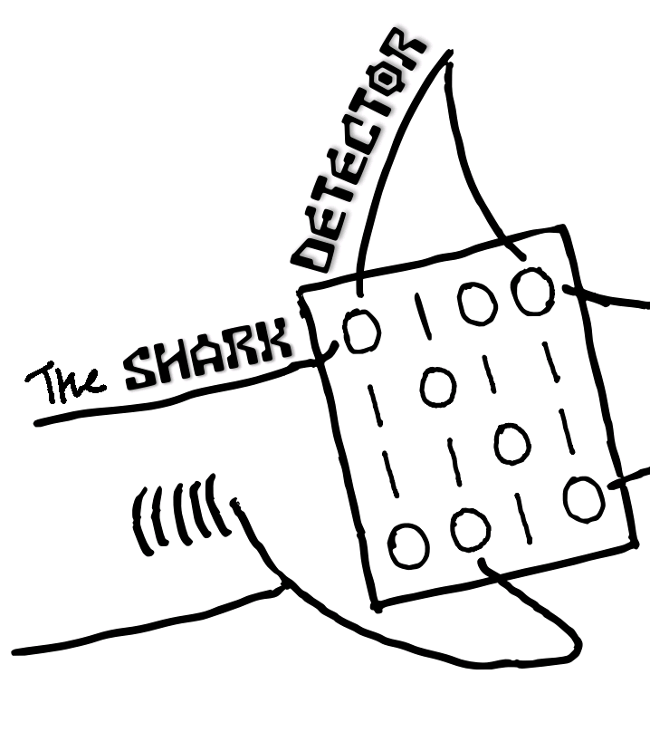
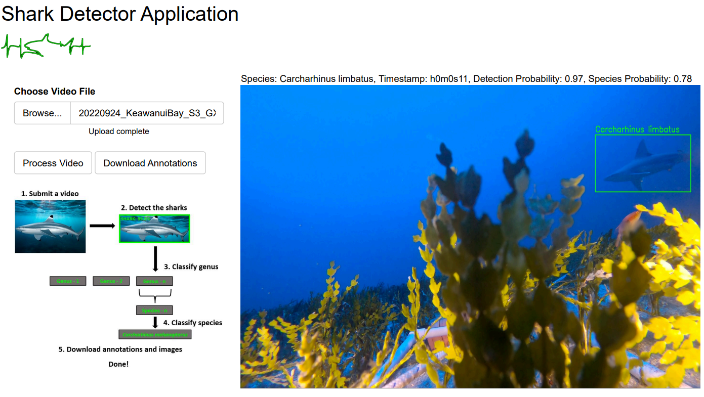

# sharkDetectorR <a href="http://seaql.org/wp-content/uploads/2022/06/SD.pdf"></a>

This R package provides functions for shark detection and classification from videos and images. It includes functions to submit videos and images to a Flask API for processing, and to visualize performance metrics.

The Shark Detector is an AI application for detecting and taxonomically classifying shark species in visual media. Videos and images are processed stepwise, beginning with 1) extracting frames, 2) detecting any shark subjects, 3) cropping shark subjects to remove background noise, and taxonomically classifying to the genus and then species level, and finally 4) producing annotations.

[sharkPulse](https://sp2.cs.vt.edu) is an advanced cyber infrastructure designed to crowdsource global sightings and generate conservation knowledge with multiple computer vision, machine learning, and data science workflows. The Shark Detector functions as the main work engine to automate shark detection and species classification, and ingest new information to continuously improve itself. By demonstrating this AI platform in Hawaii, we show how easy and effective it is to boost the Shark Detector and advance new baselines of classification performance.   

We rely on crowdsourcing efforts to increase AI performance, so if you have footage of sharks that you want to contribute, please reach to the contacts below!

## Installation

You can install the package directly from GitHub using the `devtools` package:

```r
devtools::install_github("sharkPulse/sharkDetectorR")
```

## Usage
- Process video
```r
library(sharkDetectorR)

result <- process_video("video.mp4", download = FALSE, crop = FALSE)
print(result)
```

For the graphical interface of this function, please visit sharkPulse for the [video processor](http://sharkpulse.org/video-processor).

<p align="left">
  
</p>

- Process image
```r
result_image <- process_image("image.jpg")
print(result_image)
```

- Plot performance metrics
```r
performance()  # For all genera
performance("Alopias")  # For genus "Alopias"
```

- List available shark species
```r
shark_metrics <- list_sharks()
print(shark_metrics)
```

The Shark Detector has the most diverse dataset of shark species in the world, describing over 300 species and 69 classifiable species. To see a summary of the full training dataset, see the [Taxonomy Table](https://sp2.cs.vt.edu/dynamic/queryTax1.php). As we continue to crowdsource global observations, the performance and taxonomic range of the Shark Detector will increase!

## Contact
Author: Jeremy F. Jenrette
- Email: jjeremy1@vt.edu
