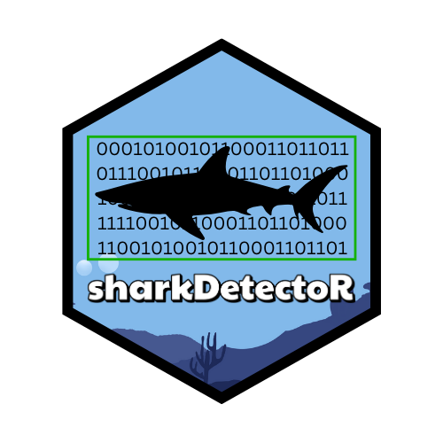
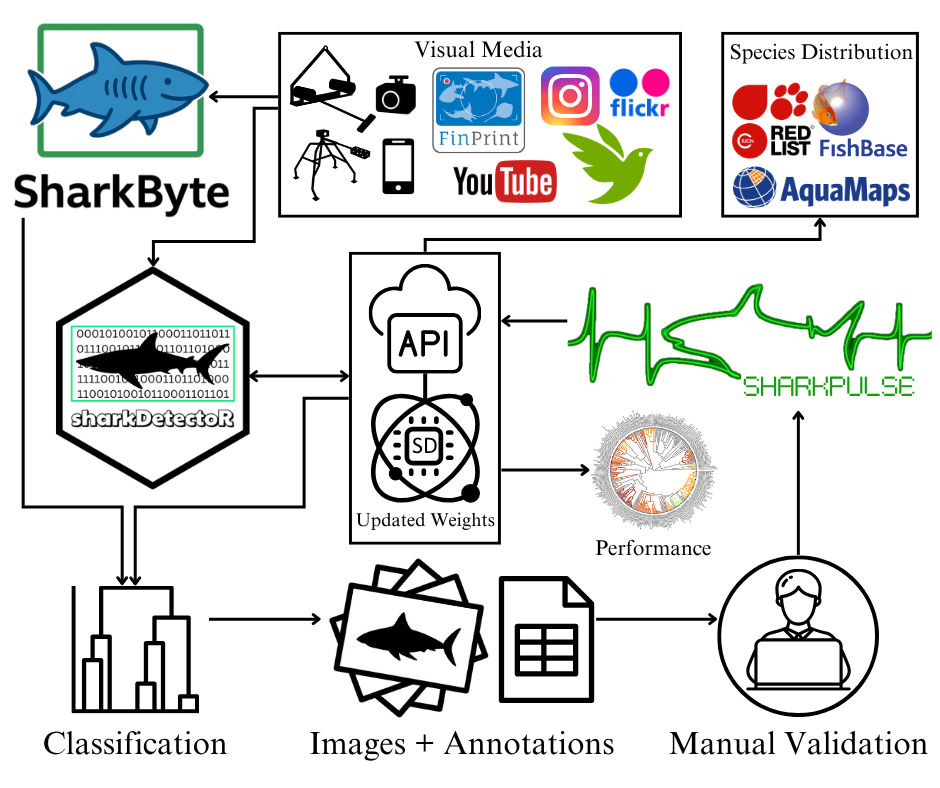

# sharkDetectoR 

This R package provides functions for shark detection and classification from images. It includes functions to submit images to a Flask API for processing, and to visualize performance metrics. The Shark Detector can classify 80 species of sharks with an average accuracy of 92%.  

The Shark Detector is an AI application for detecting and taxonomically classifying shark species in visual media. Videos and images are processed stepwise, providing YOLO‑based shark detection and hierarchical taxonomic classification (Order → Family → Genus → Species).

[sharkPulse](https://sp2.cs.vt.edu) is an advanced cyber infrastructure designed to crowdsource global sightings and generate conservation knowledge with multiple computer vision, machine learning, and data science workflows. The Shark Detector functions as the main work engine to automate shark detection and species classification, and ingest new information to continuously improve itself.  

We rely on crowdsourcing efforts to increase AI performance, so if you have footage of sharks that you want to contribute, please reach out to the contacts below!

## Installation

You can install the package directly from GitHub using the `devtools` package:

```r
devtools::install_github("sharkPulse/sharkDetectoR")
```

## Configuration

To use `sharkDetectoR`, process an image or a batch of images with these functions. Additionally, generate the most up-to-date performance reports and print the current list of classifiable shark genera and species and their corresponding accuracy. Media can be processed to return shark detections, bounding box coordinates, species classifications, prediction probability, and the name of the cropped and original (parent) image. Multiple detection boxes can be drawn per image.

## Functions

### Object detection
```r
detect_image(
  image_path,         # path to local JPEG/PNG file
  threshold  = 0.25,  # YOLO confidence threshold [0,1]
  draw_boxes = FALSE, # if TRUE, downloads one annotated image
  crop       = FALSE, # if TRUE, downloads each cropped patch
  save_dir   = "./"   # where to save downloaded images ("images" subfolder)
)
```

Returns a data.frame with columns:
- xmin, ymin, xmax, ymax: box coordinates
- score: detection confidence
- label: character (“shark” for class 0)
- annotated_image: base-name of the annotated image (or NA)
- cropped_images: list-column of crop file names (or empty list)


<p align="left">
  
</p>

### Binary classification
```r
is_shark(
  image_path # path to JPEG/PNG file
  )
```

Returns a data.frame with columns:
- img_path
- shark_confidence


### Classify species
```r
classify_image(
  image_path, # path to JPEG/PNG file
  topk = 1    # number of taxonomy candidates to return
)
```

Returns a data.frame with columns:
- order, family, genus, species
- p_order, p_family, p_genus, p_species
- joint_score

### Combine Detection and Classification
```r
detect_and_classify(
  image_path,        # path to JPEG/PNG file
  threshold  = 0.25, # YOLO confidence threshold
  draw_boxes = FALSE,# download annotated image
  crop       = FALSE,# download each cropped patch
  topk       = 1,    # number of taxonomy candidates per detection
  save_dir   = "./"  # where to save downloaded images
)
```

Returns a data.frame with columns:
- xmin, ymin, xmax, ymax: box coords
- score: detection confidence
- label: “shark” for class 0
- order, family, genus, species: predicted taxa
- p_order, p_family, p_genus, p_species: conditional probabilities
- joint_score: product of the four probabilities
- annotated_image: name of the annotated image (if requested)
- cropped_image: name of the cropped patch (if requested)

### Retrieve Model Metrics

```r
metrics_df <- get_metrics() 
```

Columns:
- level: order|family|genus|species
- class: taxon name
- precision, recall, f1score: numeric
- n_train, n_val, n_test: counts

### Retrieve List of Sharks in Geographic Bounds

The `find_species` function allows you to query the IUCN and Aquamaps species distribution for any given geographical polygon. By scanning potential survey locations for assessment-driven species distributions, this function systematically informs biodiversity expectations and AI data-boosting efforts.

```r
# Sample usage
result <- find_species(xmin = -70, ymin = 40, xmax = -69, ymax = 41)
head(result[1:5])
species                 DepthRangeComDeep DepthRangeComShallow    
1  Alopias superciliosus               730                    0
2       Alopias vulpinus               650                    0
3      Amblyraja jenseni              3000                  165
4      Amblyraja radiata              1540                    5
5       Apristurus manis              1900                  600
6 Apristurus melanoasper              1520                  512
  aquamaps2020_prob             bbox category class       condition
1              0.14 -70, 40, -69, 41       VU shark Possibly Extant
2              0.84 -70, 40, -69, 41       VU shark          Extant
3              0.72 -70, 40, -69, 41       LC   ray          Extant
4              0.89 -70, 40, -69, 41       VU   ray          Extant
5                NA -70, 40, -69, 41       LC shark          Extant
6              0.15 -70, 40, -69, 41       LC shark          Extant
```

- `xmin` Numeric, minimum longitude of the bounding box.
- `ymin` Numeric, minimum latitude of the bounding box.
- `xmax` Numeric, maximum longitude of the bounding box.
- `ymax` Numeric, maximum latitude of the bounding box.

- **`species`**: The scientific name of each species present within the specified radius.
- **`aquamaps2020_prob`**: The average probability of occurrence from Aquamaps data within the specified radius. If no data is available, this value will be `NA`.
- **`category`**: The IUCN Red List conservation category for each species (e.g., `VU` for Vulnerable, `LC` for Least Concern).
- **`class`**: Classification as `shark` or `ray`.
- **`condition`**: Species presence condition, indicating if the species is known to be `Extant` (confirmed) or `Possibly Extant` in the specified area.
- **`DepthRangeComShallow`** Fishbase *common* depth classification (shallow)
- **`DepthRangeComDeep`** Fishbase *common* depth classification (deep)

The Shark Detector has the most diverse dataset of shark species in the world, describing over 300 species. To see a summary of the full training dataset, see the [Taxonomy Table](https://sp2.cs.vt.edu/dynamic/queryTax2.php). As we continue to crowdsource global observations, the performance and taxonomic range of the Shark Detector will increase!

## Contact
Author: Jeremy F. Jenrette
- Email: jjeremy1@vt.edu
